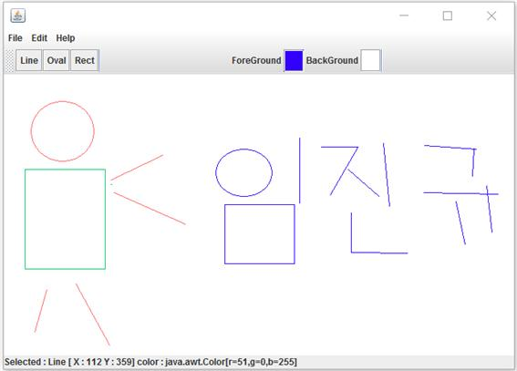

java로 구현한 그림판
============
>학과 수업인 자바프로그래밍의 최종과제로 JAVA를 이용해 GUI로 그림판을 구현하였다.

개발 기간 및 환경
-------------
* 기간 : 2015.11 ~ 2015.11
* OS : window 10
* Language : JAVA
* Tools : Eclipse

개발 내용
-------------
* 원하는 색을 사용하여 선, 원, 사각형 등을 그리고 지울 수 있다.
* filldraw기능을 통해 도형의 내부에 색을 채울 수 있다.
* save, load기능을 통해 이미지를 저장하고 불러올 수 있다.

실행 화면
-------------
